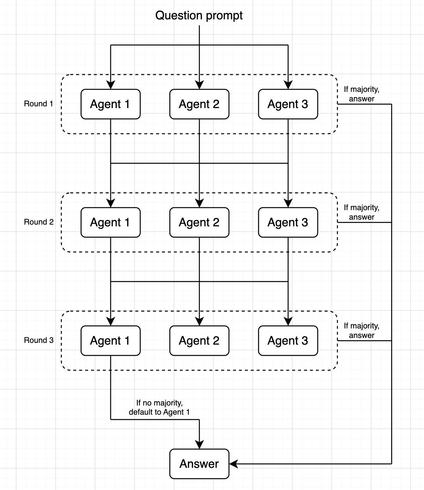
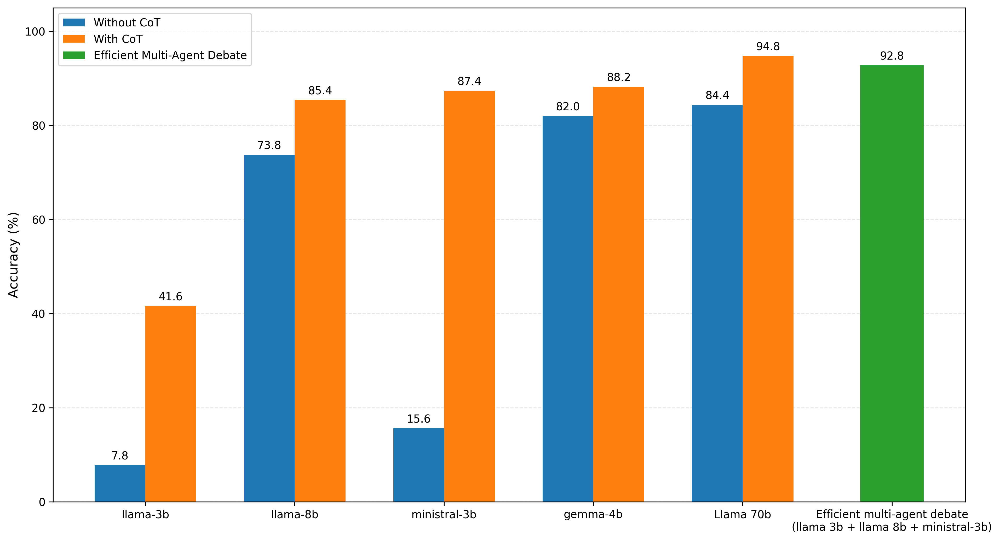

# Efficent Multi-Agent LLM Debate for GSM8K

This project implements an adaptive multi-agent LLM debate system for mathematical reasoning on the GSM8K benchmark. Three different LLMs independently solve each problem, and additional debate rounds are only triggered when the agents disagree.



## Results

The system was evaluated on **500 GSM8K questions** and achieved:

| Metric | Result |
|---|---:|
| **Accuracy** | **92.8%** |
| **Average LLM calls / question** | **3.6** |
| **Cases avoiding additional debate** | **90%** |
| **Total parameters** | **14B** |
| **Total cost (500 questions)** | **$0.0539** |

- The three-agent system uses **Llama 3.2 3B + Llama 3.1 8B + Ministral 3B**, for a combined **14B parameters**. This is approximately **5× fewer parameters** than Llama 70B. Since LLM inference compute is roughly proportional to the number of parameters, this corresponds to approximately **5× lower model compute**.

- Despite using substantially smaller models, the system achieved **92.8% accuracy**, only slightly lower than the **94.8% accuracy** of Llama 70B.

- The adaptive pruning strategy required only **3.6 LLM calls per question on average**, with **90% of questions avoiding additional debate rounds**.

- The three agents are queried **asynchronously and concurrently**, so the three LLM calls within a round run in parallel. As a result, adding multiple agents does not multiply the inference time by the number of agents.

- The total cost for the 500-question evaluation was **$0.0539**, only slightly higher than the **$0.05146** cost of the Llama 70B baseline.



## How It Works

### Round 1

Three heterogeneous LLM agents independently solve the same problem.

```text
             GSM8K Problem
                  │
        ┌─────────┼─────────┐
        ↓         ↓         ↓
     Llama 3B  Llama 8B  Ministral 3B
        │         │         │
        └─────────┼─────────┘
                  ↓
             Majority?
```

If at least two agents produce the same answer, the system stops immediately.

### Debate Rounds

If there is no majority, each agent receives:

- The original problem
- Its own previous solution
- The other two agents' full solutions

```
          No Majority
                  │
        ┌─────────┼─────────┐
        ↓         ↓         ↓
     Agent 1   Agent 2   Agent 3
        │         │         │
        └─────────┼─────────┘
                  ↓
        Share solutions +
           reconsider
                  │
                  ↓
             Majority?
              /      \
            Yes       No
             ↓         ↓
           Stop    Next round
```

The agents then re-solve the problem. This process can continue for a maximum of three rounds.

If no majority is reached after Round 3, Agent 1's answer is selected.

## Efficiency

- Each question requires between **3 and 9 LLM calls**, depending on whether additional debate is necessary.

- The adaptive strategy avoids running unnecessary rounds on most questions while still allowing difficult problems to receive additional reasoning.

- Within each round, all three agents are executed concurrently using Python's `asyncio`, keeping the inference time for a round approximately equivalent to that of a single sequential LLM call rather than three sequential calls.

## Models

| Agent | Model | Parameters |
|---|---|---:|
| Agent 1 | `meta-llama/llama-3.2-3b-instruct` | 3B |
| Agent 2 | `meta-llama/llama-3.1-8b-instruct` | 8B |
| Agent 3 | `mistralai/ministral-3b-2512` | 3B |
| **Total** | | **14B** |

## Running the Project

Install the dependencies:

```bash
pip install openai python-dotenv pandas
```

Add your OpenRouter API key to `.env`:

```text
OPENROUTER_API_KEY=your_api_key_here
```

Then run:

```bash
python efficient_debate.py
```

Results are written to `efficient-debate-results.csv` after each completed question, so completed results are preserved if the evaluation is interrupted.
